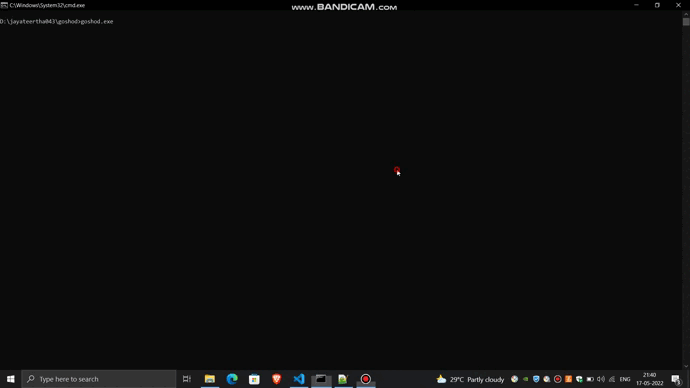

<h1 align="center">GoShoD</h1>

>Golang implementation of Shodan GUI search using API key. 


## REQUIREMENTS AND INSTALLATION

Build GoShoD:
```
git clone https://github.com/jayateertha043/goshod.git
cd goshod
go build goshod.go
```

or

Install using Go:

```
go install github.com/jayateertha043/goshod@latest
```

Run GoShoD:

```
.\goshod -h
```

## USAGE:



Configure Shodan API:

```
.\goshod -api="YOUR_API_KEY"
```

Run GoShod:

```
.\goshod
```

>Note:Ensure you have git version>1.8 & you should have shodan_config.txt with your shodan api key inside it.

## Author

👤 **Jayateertha G**

* Twitter: [@jayateerthaG](https://twitter.com/jayateerthaG)
* Github: [@jayateertha043](https://github.com/jayateertha043)

